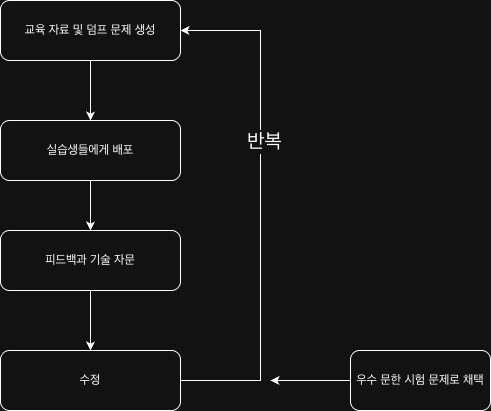

# ☁️ Region 및 Availability Zone 개념 

이 문서는 카카오클라우드의 최신 공식 가이드에 따라 물리적 위치(Region, AZ)와 논리적 네트워크(VPC)의 구성을 정리한 문서입니다.

---
# 1. 💡 핵심개념

## 1. 리전 (Region)
리전은 지리적으로 독립된 위치에 존재하는 데이터 센터들의 거점, 하나 이상의 가용 영역(AZ)으로 구성됩니다.

* **지리적 격리:** 각 리전은 서로 지리적으로 격리되어 있으며, 다른 리전과는 완전히 분리된 환경을 제공하며 리소스가 자동으로 복제되지 않습니다.
* **리전 선택:** 사용자는 지연 시간 최소화 및 법적 준수를 위해 가장 적합한 위치의 리전을 선택가능합니다.

### 📍 사용 가능한 리전 현황
| 대상 고객 | 리전 이름 | 리전 코드 | 위치 | 가용 영역(AZ) |
| :--- | :--- | :--- | :--- | :--- |
| **일반/기업** | 한국 중부 제2리전 | `kr-central-2` | 수도권 | a, b, c (d 예정) |
| **공공기관** | 공공 중부 제2리전 | `kr-gov-central-2` | 수도권 | a |

---

## 2. 가용 영역 (Availability Zone, AZ)
리전 내에서 물리적으로 격리된 독립 데이터 센터 공간입니다.

* **물리적 격리:** 모든 AZ는 **100km 이내의 거리**에 위치하면서도, 화재/지진 등 재해로부터 안전하도록 서로 격리되어 있습니다.
* **고가용성 설계:** 여러 가용 영역에 리소스를 분산 배치하면 특정 AZ 장애 시에도 서비스 중단을 막을 수 있습니다.
* **식별 코드:** 리전 코드 뒤에 문자를 조합하여 표기합니다. (예: `kr-central-2-a`)

---

# 3. 💡 적용형 개념

### ✅ VPC와 AZ의 관계
* **VPC 생성 시:** 리전을 먼저 선택합니다. (한번 정하면 변경 불가)
* **서브넷 생성 시:** 특정 AZ를 선택하여 네트워크 영역을 나눕니다.
* **리소스 배치:** 인스턴스(BCS)나 데이터베이스를 생성할 때, 미리 만들어둔 **특정 AZ의 서브넷**을 선택하여 물리적 위치를 결정합니다.

## ⚖️ 리전(Region)과 가용 영역(AZ) 비교

리전과 가용 영역의 핵심 차이점을 한눈에 파악할 수 있도록 정리한 비교표입니다.

| 구분 | 리전 (Region) | 가용 영역 (AZ) |
| :--- | :--- | :--- |
| **개념** | 지리적 거점 (도시 단위) | 리전 내 격리된 데이터 센터 그룹 |
| **주요 목적** | 거주 지역 법규 준수, 지연 시간 단축 | 장애 격리(Fault Isolation), 고가용성 보장 |
| **복제** | **수동** (리전 간 자동 복제되지 않음) | 서비스 옵션에 따라 **자동/수동** 복제 가능 |
| **코드 예시** | `kr-central-2` | `kr-central-2-a` |

---

### 💡 핵심 요약 (헷갈림 방지)
* **리전 선택**은 주로 **"어디에서 서비스를 제공할 것인가(위치)"**와 관련이 있으며,
* **가용 영역 활용**은 **"시스템이 어떻게 장애를 견딜 것인가(안정성)"**와 관련이 있습니다.

> **Tip:** 카카오클라우드에서는 높은 내결함성을 위해 최소 2개 이상의 가용 영역(Multi-AZ)에 리소스를 분산 배치할 것을 강력히 권장합니다.

### ✅ 헷갈리기 쉬운 포인트: "보안과 가용성"
* **가용성 증대:** 하나의 리전 내에서 **여러 AZ**에 분산 배치 (데이터 센터 장애 대비)
* **보안 수준 강화:** 리소스를 **여러 리전**에 배치하여 지리적/법적 안전성 확보
### 🏗️ 시스템 아키텍처 설계도

### [Scenario] 서비스 중단 없는 아키텍처 구성

1. **설정:** `kr-central-2` 리전에 VPC를 생성합니다.
2. **배포:** - **서브넷 A** (가용 영역 `kr-central-2-a`에 위치)에 서버 1대 배치
   - **서브넷 B** (가용 영역 `kr-central-2-b`에 위치)에 서버 1대 배치
3. **상황:** 수도권 인근 낙뢰로 인해 `kr-central-2-a` 데이터 센터가 일시 정전됨.
4. **결과:** - 가용 영역 A의 서버는 중단되지만, **가용 영역 B의 서버는 정상 작동**합니다.
   - **Load Balancing** 서비스와 연동되어 있다면 사용자는 장애를 느끼지 못하고 안정적으로 접속됩니다.

---

## 🛠️ 관리 및 제약 사항
* **권한:** VPC 및 네트워크 구성은 **프로젝트 관리자(Admin)** 권한이 필요합니다.
* **리소스 가시성:** 콘솔 상단에서 선택한 리전에 속한 리소스만 화면에 표시됩니다. (리전이 다르면 보이지 않음)
* **추가 서비스:** 고가용성 유지를 위해 **Load Balancing**, **Auto Scaling**, **AZ 간 데이터 복제** 기능을 함께 활용하는 것을 권장합니다.

---
*참고: [카카오클라우드 공식 사용자 가이드](https://docs.kakaocloud.com)*
*최종 업데이트: 2026-04-09*
*작성일: 2026-04-09*

