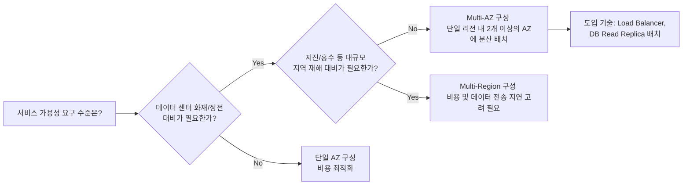

# Domain 1. Cloud Fundamentals - Region 과 Availability Zone(AZ)

  <i>작성일자: 2026-04-09 | 작성자: olivia</i>

---

## 💡핵심 개념 정리 

* **Region (리전)**
  * **정의:** 카카오클라우드 서비스가 제공되는 물리적인 지리적 위치 (예: 한국 중부, 미국 서부 등).
  * **특징:** 각 리전은 서로 완전히 독립적으로 설계되어 있어, 한 리전에 대규모 재해(지진, 홍수 등)가 발생해도 다른 리전의 서비스에는 영향을 미치지 않습니다.
    
* **Availability Zone (가용 영역, AZ)**
  * **정의:** 하나의 리전 내에 존재하는 독립적인 데이터 센터들의 묶음.
  * **특징:** 서로 다른 전력망, 네트워킹, 냉각 시설을 사용하므로 하나의 AZ에 장애(정전, 화재 등)가 발생해도 다른 AZ는 정상 작동합니다. AZ 간은 전용 초고속 네트워크로 연결되어 지연 시간이 매우 짧습니다.

 

## 🤔개념 비교 분석 

리전과 가용 영역은 모두 '고가용성'을 위해 존재하지만, 방어하는 **장애의 규모**와 **네트워크 지연 시간**에서 차이점이 있습니다.

| 비교 항목 | Availability Zone (가용영역, AZ) | Region (리전) |
| :--- | :--- | :--- |
| **목적** | 단일 데이터 센터 수준의 장애 대비 (정전, 화재) | 국가/지역 단위의 대규모 재해 대비 (지진, 전쟁) |
| **네트워크 지연** | 매우 짧음 (밀리초 단위, 실시간 동기화 가능) | 상대적으로 김 (비동기 복제 권장) |
| **도메인 1 연관성** | **서브넷(Subnet)** 은 일반적으로 하나의 AZ에 종속됨 | **VPC** 는 리전 단위로 생성되며, 리전 내 모든 AZ를 포괄함 |

### 🚨 헷갈리지 마세요!
* **함정 1: "VPC는 특정 가용 영역(AZ)에 생성된다." (X)**
  * 해설: VPC는 **리전(Region)** 단위의 리소스입니다. 반면 서브넷(Subnet)은 특정 **AZ** 단위로 생성됩니다. 이 단위의 차이가 시험에서 단골 오답 선지로 등장합니다.
* **함정 2: [Domain 3 연계] "AZ 간 데이터 전송은 항상 무료이다." (X)**
  * 해설: 같은 리전이더라도 **다른 AZ로 트래픽이 넘어갈 때는 데이터 전송 비용이 발생**합니다.
    
📍Domain 3: Pricing & Cost Management 관련 비용문서 링크()

 

## ✅실무 시나리오 

**고가용성 아키텍처 설계**
> "우리 쇼핑몰은 데이터 센터 한 곳에 불이 나더라도 서비스가 절대 중단되면 안 됩니다. 하지만 비용도 한정적이어서 해외 리전까지 이중화할 여력은 없습니다. 어떻게 설계해야 할까요?"

* **운영 팁:** 이 경우 단일 리전 내에서 **멀티 AZ(Multi-AZ)** 아키텍처를 구성하는 것이 정답입니다. 웹 서버를 AZ-a와 AZ-b에 분산 배치하고, **Domain 2의 Load Balancing**을 통해 트래픽을 양쪽으로 분산시켜야 합니다.

📍로드밸런싱 설명 기술문서 링크()

### 🌳 의사결정 트리를 따라가보세요!

## 🔍문항 아이디어

**실무 시나리오를 바탕으로, 제약 조건 속에서 최적의 고가용성 아키텍처를 찾아낼 수 있는지 평가합니다.**

---

### 📝 문항 예시

**Q. A 기업은 다가오는 대규모 할인 행사를 앞두고 카카오클라우드로 인프라를 마이그레이션하려고 합니다. 이 기업은 과거 특정 데이터 센터의 물리적 전력망 장애로 서비스가 중단된 경험이 있어 이를 최우선으로 방어하고자 합니다. 단, 한정된 예산으로 인해 해외 데이터 센터로의 이중화는 불가능하며, 데이터베이스의 실시간 동기화를 위해 네트워크 지연 시간은 최소화되어야 합니다. 다음 중 A 기업에게 가장 적합한 카카오클라우드 아키텍처 구성은 무엇입니까?**

- [ ] ① 가용성을 극대화하기 위해 한국 중부 리전과 미국 서부 리전에 인스턴스를 분산 배치한다.
- [x] **② 동일한 한국 중부 리전 내의 서로 다른 두 가용 영역(AZ)에 인스턴스를 분산 배치한다.**
- [ ] ③ 인스턴스의 사양(Scale-up)을 최대한 높여 단일 가용 영역 내에서 트래픽 처리 성능을 극대화한다.
- [ ] ④ 비용 절감을 위해 단일 가용 영역에 배치하되, 주기적으로 Object Storage에 스냅샷을 생성하여 백업한다.

 

### 🎯 오답 포인트

* **응시자 팁:** 지문 속 핵심 키워드 두 가지를 매칭해야 합니다.
  1. *"특정 데이터 센터의 전력망 장애"* ➔ **단일 AZ 장애** 방어 필요
  2. *"예산 제한 / 실시간 동기화(최소 지연)"* ➔ **단일 리전 내 구성** 필요
  이 두 조건을 모두 만족하는 고가용성 구성은 **②번(Multi-AZ)**뿐입니다.

* **해설:** **①번(Multi-Region):** '고가용성'이라는 키워드만 보고 성급히 고르도록 유도하는 함정입니다. 지문의 '비용 제한'과 '최소 지연 시간' 조건을 어기므로 매우 매력적인 오답이 됩니다.
  * **③, ④번:** 인프라 운영에서 흔히 쓰이는 성능 향상(Scale-up) 및 백업 전략이지만, 현재 시나리오의 핵심인 '물리적 데이터 센터의 장애(가용성)' 자체를 방어할 수는 없음을 수험자가 명확히 아는지 테스트하는 선지입니다.

